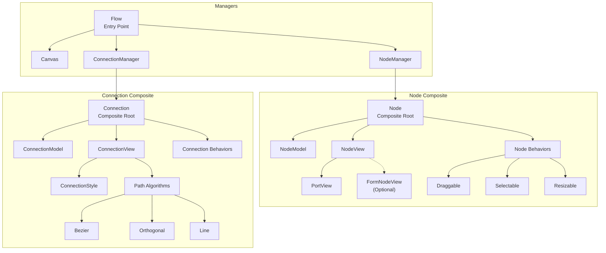
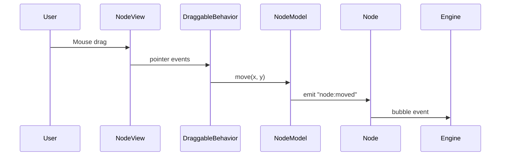
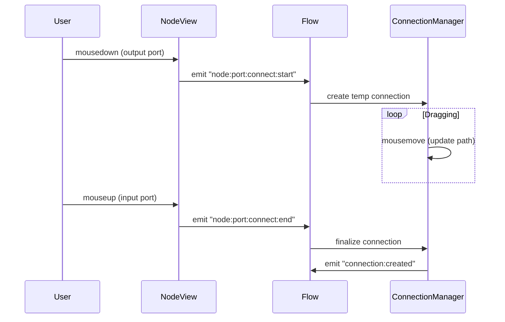

# 🧩 Floxy Component Architecture

Floxy uses a **Composite Architecture** for both nodes and connections. Components are **not single classes**, but compositions of **model, view, and behaviors**, coordinated through events.

This design allows Floxy to support multiple diagram styles:

- Workflow editors
- Diagramming tools
- Freeform canvases
- ER diagrams
- Form-based configuration nodes

---

## 📐 Core Design Principles

| Principle                      | Description                                    |
| ------------------------------ | ---------------------------------------------- |
| **Model owns state**           | All data lives in the model layer              |
| **View owns DOM**              | All rendering is handled by view classes       |
| **Behaviors own interaction**  | User interactions are pluggable                |
| **Managers do not render UI**  | Managers coordinate, they don't draw           |
| **Event-driven communication** | Everything communicates via `EmitterComponent` |

---

## 🏗️ System Architecture

The following diagram illustrates the hierarchy and composition of the entire Floxy system, starting from the main `Flow` engine down to individual component behaviors.




---

## 🔷 Nodes

### High-Level Node Composition

```
┌─────────────────────────────────────────────────────────────┐
│                         Node                                │
│                    (Composite Root)                         │
├─────────────────┬─────────────────┬─────────────────────────┤
│    NodeModel    │    NodeView     │      Behaviors          │
│                 │                 │                         │
│  • id           │  • html()       │  • DraggableBehavior    │
│  • name         │  • init()       │  • SelectableBehavior   │
│  • x, y         │  • destroy()    │  • ResizableBehavior    │
│  • inputs       │  • move()       │  • EditableLabelBehavior│
│  • outputs      │  • getBounds()  │                         │
│  • data         │  • getPort      │                         │
│  • capabilities │    Position()   │                         │
└─────────────────┴─────────────────┴─────────────────────────┘
```

### Component Files

| File                  | Purpose                                                    |
| --------------------- | ---------------------------------------------------------- |
| `Node.js`             | Composite root that coordinates model, view, and behaviors |
| `NodeModel.js`        | Holds node state (position, ports, data, capabilities)     |
| `NodeView.js`         | Base class for rendering nodes to DOM                      |
| `FormNodeView.js`     | Specialized view for form-based nodes                      |
| `SVGNodeView.js`      | View for SVG-based diagram nodes                           |
| `NodeViewRegistry.js` | Registry for custom node view types                        |

### NodeModel Properties

```javascript
{
  id: Number,           // Unique identifier
  name: String,         // Node type name
  module: String,       // Module namespace (default: "default")
  group: String,        // Grouping category (default: "default")
  label: String,        // Display label (falls back to name)
  x: Number,            // X position on canvas (default: 0)
  y: Number,            // Y position on canvas (default: 0)
  w: Number,            // Width (default: 200)
  h: Number,            // Height (default: 100)
  inputs: Number,       // Number of input ports (default: 1)
  outputs: Number,      // Number of output ports (default: 1)
  data: Object,         // Custom node data (default: {})
  capabilities: Array,  // Enabled behaviors
  extras: Object        // Additional metadata (default: {})
}
```

### Node Capabilities

Capabilities define what behaviors a node supports:

| Capability       | Description                     |
| ---------------- | ------------------------------- |
| `selectable`     | Node can be selected/deselected |
| `movable`        | Node can be dragged on canvas   |
| `editable-label` | Node label can be edited inline |
| `resizable`      | Node can be resized             |
| `removable`      | Node can be deleted             |

### Built-in Node Views

#### BaseNodeView

The default node view with rectangular shape, input/output ports, and standard styling.

#### FormNodeView

Specialized for form-based configuration nodes:

- Renders HTML forms inside nodes
- Supports various input types (text, password, select, textarea, checkbox)
- Persists form data to `model.data.form_values`
- Password fields include visibility toggle

```javascript
// Register custom form HTML
window.flow_form_functions = {};
window.flow_form_functions.my_form = () => `
  <div>
    <label>Config Name</label>
    <input type="text" name="config_name" placeholder="Enter name">
  </div>
`;
```

#### SVGNodeView

For custom SVG-based node shapes (circles, ellipses, diamonds, etc.).

---

## 🔗 Connections

### High-Level Connection Composition

```
┌─────────────────────────────────────────────────────────────┐
│                       Connection                            │
│                    (Composite Root)                         │
├─────────────────┬─────────────────┬─────────────────────────┤
│ ConnectionModel │ ConnectionView  │    Behaviors            │
│                 │                 │                         │
│  • id           │  • init()       │  • SelectableBehavior   │
│  • outNodeId    │  • update()     │  • PathStyleBehavior    │
│  • outPort      │  • destroy()    │                         │
│  • inNodeId     │  • applyStyle() │                         │
│  • inPort       │                 │                         │
│  • pathType     │                 │                         │
│  • style        │                 │                         │
└─────────────────┴─────────────────┴─────────────────────────┘
```

### Component Files

| File                 | Purpose                              |
| -------------------- | ------------------------------------ |
| `Connection.js`      | Composite root for connections       |
| `ConnectionModel.js` | Holds connection state and endpoints |
| `ConnectionView.js`  | Renders SVG paths between nodes      |
| `ConnectionStyle.js` | Manages connection visual styles     |
| `paths/`             | Path generation algorithms           |

### ConnectionModel Properties

```javascript
{
  id: String,           // Unique identifier (format: "outNodeId:outPort-inNodeId:inPort")
  outNodeId: Number,    // Source node ID
  outPort: Number,      // Source port index
  inNodeId: Number,     // Target node ID
  inPort: Number,       // Target port index
  pathType: String,     // Path style ("bezier", "line", "orthogonal")
  capabilities: Array,  // Enabled behaviors
  style: ConnectionStyle // Visual style object
}
```

### Connection Path Types

| Type         | Description                   | Use Case                                |
| ------------ | ----------------------------- | --------------------------------------- |
| `bezier`     | Smooth curved paths (default) | General purpose, aesthetically pleasing |
| `line`       | Direct straight lines         | Simple diagrams, minimal style          |
| `orthogonal` | Right-angle connector paths   | Flowcharts, technical diagrams          |

### ConnectionStyle Properties

```javascript
{
  stroke: String,       // Custom stroke color (optional)
  width: Number,        // Stroke width (default: 2)
  dash: String|null,    // Dash pattern (e.g., "5,5")
  animated: Boolean,    // Enable flow animation
  path: String,         // Current path type (default: "bezier")
  arrows: {
    start: Boolean,     // Show arrow at start (default: false)
    end: Boolean        // Show arrow at end (default: true)
  },
  // Semantic states (managed internally)
  bad: Boolean,         // Mark as invalid connection
  hover: Boolean,       // Hover state
  selected: Boolean,    // Selection state
  temp: Boolean,        // Temporary (drawing) state
  execution: Boolean,   // Execution highlight animation
  speed: Number         // Animation speed (execution_speed, default: 2)
}
```

### Connection Capabilities

| Capability        | Description                   |
| ----------------- | ----------------------------- |
| `selectable`      | Connection can be selected    |
| `removable`       | Connection can be deleted     |
| `path:bezier`     | Can use bezier path style     |
| `path:line`       | Can use line path style       |
| `path:orthogonal` | Can use orthogonal path style |

---

## ⚡ Events

### Node Events

| Event                     | Description                 | Payload                                              |
| ------------------------- | --------------------------- | ---------------------------------------------------- |
| `node:removed`            | Node was deleted            | `{ id }`                                             |
| `node:pointer:down`       | Mouse down on node          | `{ event }`                                          |
| `node:moved`              | Node position changed       | `{ id, x, y }`                                       |
| `node:selected`           | Node was selected           | `{ id, cx, cy }`                                     |
| `node:deselected`         | Node was deselected         | `{ id }`                                             |
| `node:dropped`            | Node dropped from palette   | `{ module, group, name, label, x, y, data, extras }` |
| `node:updated`            | Node properties changed     | `{ id, x, y, w, h }`                                 |
| `node:label:updated`      | Node label changed          | `{ id, label }`                                      |
| `node:resized`            | Node size changed           | `{ id, w, h }`                                       |
| `node:port:connect:start` | Started drawing connection  | `{ nodeId, portIndex, event }`                       |
| `node:port:connect:end`   | Finished connection on port | `{ nodeId, portIndex, event }`                       |

### Connection Events

| Event                   | Description            | Payload                                        |
| ----------------------- | ---------------------- | ---------------------------------------------- |
| `connection:created`    | New connection made    | `{ id, outNodeId, outPort, inNodeId, inPort }` |
| `connection:removed`    | Connection deleted     | `{ id }`                                       |
| `connection:updated`    | Connection changed     | `{ id }`                                       |
| `connection:clicked`    | Connection was clicked | `{ id }`                                       |
| `connection:selected`   | Connection selected    | `{ id, cx, cy }`                               |
| `connection:deselected` | Connection deselected  | `{ id }`                                       |

---

## 🎨 Behaviors

Behaviors attach interaction logic without modifying component structure.

### Node Behaviors

| Behavior                | File                | Description                |
| ----------------------- | ------------------- | -------------------------- |
| `DraggableBehavior`     | `draggable.js`      | Enables node dragging      |
| `SelectableBehavior`    | `selectable.js`     | Click to select/deselect   |
| `ResizableBehavior`     | `resizable.js`      | Resize handles on corners  |
| `EditableLabelBehavior` | `editable_label.js` | Double-click to edit label |

### Behavior Interface

Behaviors extend `NodeCapability` (for nodes) or `ConnectionCapability` (for connections):

```javascript
import { NodeCapability } from "../capability.js";
import * as constants from "../../../constants.js";

class MyBehavior extends NodeCapability {
  static get capability() {
    return constants.CAPABILITIES.MOVABLE; // Required: capability name
  }

  gaurd() {
    // Optional: return false to prevent attachment
    return true;
  }

  attach() {
    // Called when behavior is activated
    // this.node - reference to the Node
    // this.node.view - reference to the NodeView
  }

  detach() {
    // Called when behavior is removed
    // Cleanup event listeners
  }
}
```

---

## 🏗️ Creating Custom Nodes

### Step 1: Create a Custom View

```javascript
import { BaseNodeView } from "./NodeView.js";

class MyCustomNodeView extends BaseNodeView {
  static get name() {
    return "my-custom-node";
  }

  static get modelDefaults() {
    return {
      inputs: 2,
      outputs: 1,
      w: 300,
      h: 100,
      label: "Custom Node",
      module: "custom",
      group: "mygroup",
      capabilities: ["selectable", "movable", "removable"],
    };
  }

  getNodeElement() {
    return `
      <div class="node custom-node">
        <div class="node-label">${this.model.label}</div>
        <div class="custom-content">
          <!-- Custom content here -->
        </div>
      </div>
    `;
  }

  bindEvents() {
    // Add custom event handlers
  }
}
```

### Step 2: Register the View

```javascript
import { nodeViewRegistry } from "./NodeViewRegistry.js";

nodeViewRegistry.register(MyCustomNodeView);
```

### Step 3: Use in Flow

```javascript
const nodeId = flow.addNode({
  module: "custom",
  group: "mygroup",
  name: "my-custom-node",
  label: "My Node",
  x: 100,
  y: 100,
});
```

---

## 🔄 Event Flow Example

### Node Movement



### Connection Creation



---

## 📁 Directory Structure

```
src/components/
├── node/
│   ├── Node.js                 # Composite root
│   ├── NodeModel.js            # State management
│   ├── NodeView.js             # Base view class
│   ├── FormNodeView.js         # Form-based nodes
│   ├── SVGNodeView.js          # SVG-based nodes
│   ├── NodeViewRegistry.js     # View type registry
│   ├── capability.js           # Capability utilities
│   ├── capabilities/
│   │   └── behaviors/
│   │       ├── draggable.js
│   │       ├── selectable.js
│   │       ├── resizable.js
│   │       └── editable_label.js
│   └── views/                  # Custom view packages
│
├── connection/
│   ├── Connection.js           # Composite root
│   ├── ConnectionModel.js      # State management
│   ├── ConnectionView.js       # SVG path rendering
│   ├── ConnectionStyle.js      # Style management
│   ├── capability.js           # Capability utilities
│   ├── capabilities/
│   │   └── behaviors/
│   └── paths/
│       ├── PathRegistry.js     # Path algorithm registry
│       ├── bezier.js           # Bezier curve paths
│       ├── line.js             # Straight line paths
│       └── orthogonal.js       # Right-angle paths
│
├── node.js                     # NodeManager
├── connection.js               # ConnectionManager
├── canvas.js                   # Canvas/viewport management
└── constants.js                # Event names & constants
```

---

## 💡 Why This Architecture?

### ✅ Extensible

Add new node types, connection styles, or behaviors without touching the core engine.

### ✅ Performant

Views only re-render when models change. Behaviors can be attached/detached dynamically.

### ✅ Diagram-Agnostic

Same engine supports workflows, ER diagrams, form builders, and freeform canvases.

### ✅ Maintainable

No god classes. Clear separation of concerns. Each component has a single responsibility.

### ✅ Testable

Models, views, and behaviors can be unit tested independently.

---

## 📝 Summary

> **Floxy components are composed, not inherited.**

This architecture keeps the engine small, flexible, and powerful — enabling Floxy to scale from simple workflows to complex diagramming systems while maintaining clean, maintainable code.
