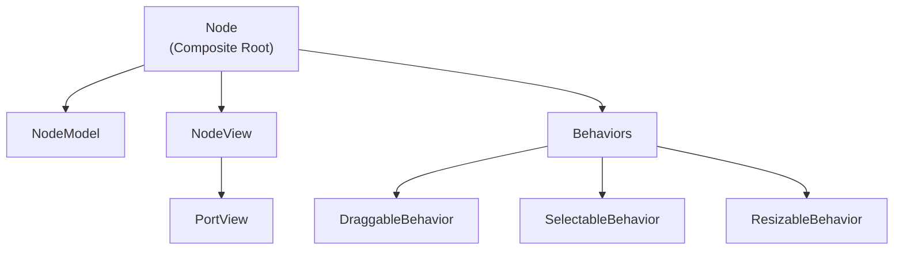
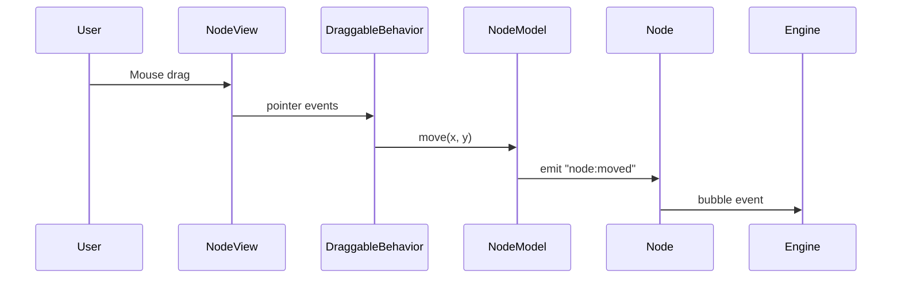

# 🧩 Floxy Node Architecture

Floxy nodes are built using a **Composite Architecture**.
A node is **not a single class**, but a composition of **model, view, and behaviors**, coordinated through events.

This design allows Floxy to support multiple diagram styles such as:

- Workflow editors
- Diagramming tools
- Freeform canvases
- ER diagrams

---

## Core Design Principles

- **Model owns state**
- **View owns DOM**
- **Behaviors own interaction**
- **Managers do not render UI**
- **Everything communicates via events (`EmitterComponent`)**

---

## High-Level Node Composition



---

## Component Responsibilities

### NodeModel
- Holds node state (position, ports, data)
- Emits state change events
- Diagram-agnostic

```ts
NodeModel
- id
- name
- x, y
- inputs, outputs
- data
```

---

### NodeView
- Responsible **only** for rendering
- Creates DOM / SVG
- Emits UI events
- Never mutates state directly

```ts
NodeView
- mount(container)
- render()
- destroy()
```

---

### PortView
- Represents connection points
- Supports typed and directional ports
- Enables ER diagrams and workflow constraints

```ts
PortView
- portId
- direction (input | output)
- type (data | control | relation)
```

---

### Behaviors
Behaviors attach interaction logic to a node without changing its structure.

Examples:
- Dragging
- Selection
- Resizing
- Inline editing
- Grouping

Each behavior:
- Can be attached or removed independently
- Uses events to communicate
- Is reusable across node types

```ts
Behavior
- attach(node)
- detach()
```

---

## Event Flow (Node Movement Example)



---

## Why This Architecture?

### Extensible
Add new node types without touching the engine.

### Performant
Views only re-render when models change.

### Diagram-Agnostic
Same engine supports workflows, ER diagrams, and freeform canvases.

### Maintainable
No god classes. Clear separation of concerns.

---

## Creating a New Node Type

To create a new node type (e.g. ER Entity, Freeform Sticky Note):

1. Create a custom NodeView
2. Choose required behaviors
3. Register it in the node registry

```js
const node = new Node({
  model,
  view: new ERNodeView(model),
  behaviors: [new DraggableBehavior(), new SelectableBehavior()],
});
```

---

## Summary

> **Floxy nodes are composed, not inherited.**

This architecture keeps the engine small, flexible, and powerful — enabling Floxy to scale from simple workflows to complex diagramming systems.
